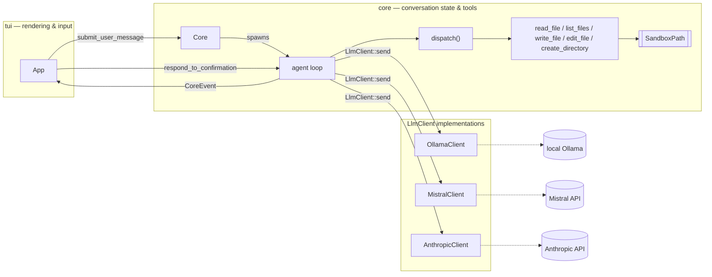

# Architecture

Maintainer-facing design decisions and the reasoning behind them —
the *why* behind each technical choice, not a restatement of what the
code already says. Current security posture lives in `SECURITY.md`.

## Overview



`core` holds conversation state, provider round-trips, and tool
execution; it has zero `ratatui`/`crossterm` imports and exposes
exactly two calls to the rest of the app —
`submit_user_message(text)` and `poll_events()` — plus
`respond_to_confirmation(choice)` for the one case where a tool call
needs to pause for a human decision (see "The confirmation gate"
below). `tui` owns all rendering and input, and never touches
conversation or tool state directly. `cli` is a third, smaller module
for command-line flag parsing, used only by `main.rs`.

Each `submit_user_message` call spawns a plain `std::thread` to do the
provider round-trip and reports back over an `mpsc` channel;
`poll_events` drains it non-blockingly, so the UI loop never stalls on
network I/O. No async runtime — a synchronous main loop plus
thread-per-request is simpler to reason about at this project's scale,
and every provider call is a single blocking HTTP request with no
concurrency of its own to manage.

## Talking to a provider: the `LlmClient` trait

`Core` never touches a provider's HTTP shape directly — it holds an
`Arc<dyn LlmClient + Send + Sync>` and calls one method:

```rust
fn send(&self, system: &str, messages: &[Message], tools: &[ToolDefinition])
    -> Result<LlmResponse, ChatError>;
```

Adding a provider means writing a new `LlmClient` implementation, not
touching `Core` — true across all three current implementations
(`OllamaClient`, `MistralClient`, `AnthropicClient`), each with a
genuinely different wire shape. `LlmResponse` is `Text(String)` for a
final answer or `ToolCalls(Vec<ToolCall>)` for one or more requested
tool invocations; each provider maps the shared `Message` history (and
`system`) into its own private wire-format type before sending, and
never sees `Message` beyond that mapping step. `system` being a
parameter of `send` itself, not folded into `messages`, fits Anthropic's
Messages API directly — `system` is its own top-level request field
there, not a message with `role: "system"` like Mistral/Ollama both
synthesize.

`Arc`, not `Box`: the concrete client isn't known until a `--provider`
flag is parsed at startup, so this is dynamic dispatch, not generics.
`Arc` specifically (not `Box`) is required because each
`submit_user_message` call spawns a new thread that needs its own
handle to the client while `Core` keeps using its own — `Arc::clone` is
an O(1) refcount bump giving the spawned thread an independent handle
to the same value, where `Box`'s exclusive ownership could only ever
hand the client to one thread, permanently.

## System prompt

Every request carries a system prompt built from three layers: a
hardcoded base prompt, global user preferences, and project-specific
preferences.

Global preferences live in `AGENTS.md` in the user's config directory,
outside the project. Project-specific preferences live in `AGENTS.md`
in the project directory itself. Both files are optional — if neither
exists, only the base prompt is sent.

The three layers combine in that order, base first: general
preferences before project-specific ones, ending closest to the actual
conversation. If both `AGENTS.md` files exist, both are included —
there's no need for one to override the other, since they're
different kinds of information (personal style vs. project facts)
rather than conflicting ones.

Both `AGENTS.md` files are read once, when the session starts. They
aren't re-read during a session, so editing either file has no effect
until the next run.

Whether each file was found is shown in the chat title for the whole
session, the same way the active provider already is — printing it
once at startup instead would go unseen, since entering the terminal
UI switches to a different screen buffer that hides anything printed
before it.

## Conversation history

`Core` holds a `Vec<Message>` that grows for the whole session and is
sent in full with every request — `Message` is an enum (`User`,
`Assistant`, `ToolCalls`, `ToolResult`), not a flat struct with
optional fields, so an invalid combination (e.g. a tool result with no
correlating id) isn't representable at all. History is unbounded and
uncompacted: nothing trims or summarizes it as it grows, so a very long
session sends a correspondingly larger request every time. That's a
deliberate scope boundary, not an oversight — summarization is a real
feature with its own design surface (when to summarize, what to
preserve), not something to bolt on as an afterthought.

`Message::ToolCalls` holds one entry per individual tool call rather
than one entry per LLM turn, even though a provider can request several
calls in a single turn. Verified against the real Mistral API with a
task that requires at least two sequential tool calls to complete:
order and `tool_call_id` correlation are what actually matter for a
correct conversation, not whether the calls are grouped into one
message or several.

`Message::ToolResult` carries both a `tool_call_id` and the tool's own
`name`, even though Mistral's wire format only ever needs the id —
Anthropic's does too (`tool_use_id`), confirmed by checking
`mistral.rs`'s own mapping before writing `anthropic.rs`'s: both
providers' `ToolResult` handling ignores `name` via `..`, needing no new
field for a second id-based provider. Ollama's `/api/chat` has no id
concept at all — it correlates a result back to its request purely by
tool name — so `OllamaClient` needs the name sitting directly on the
result rather than scanning back through history for the matching
`ToolCalls` entry. `OllamaClient` also
synthesizes its own per-turn `ToolCall.id` (a simple counter; Ollama's
response never includes one), used only for this project's own internal
bookkeeping and never sent back over the wire. The one residual gap,
not fixable from this side: Ollama's name-based correlation is
inherently ambiguous if a model calls the same tool twice in one
turn — results are sent back in call order as the best available
mitigation, same as Mistral's own id-based correlation would fall back
to if two calls ever somehow shared an id.

History is mutated only on the thread that calls `poll_events()`, never
on the background thread doing the network round-trip. That thread
gets its own cloned snapshot of history to send; `Core`'s persistent
copy is only ever appended to as `CoreEvent`s get drained. This avoids
needing a `Mutex` or any other shared-mutable-state primitive — there's
effectively a single writer.

## Sandboxing: `SandboxPath`

`SandboxPath::new(root, requested)` is the only way to construct a
validated path, and every tool function takes `&SandboxPath`, never a
raw `PathBuf`/`&str` — a call site can't forget to check containment,
because there's no path type it could pass instead that would compile.
This matters more here than in a typical file-access scenario: tool
output feeds back into the LLM conversation, so an escaped read is a
real exfiltration path, not a hypothetical one.

Containment is checked against `std::fs::canonicalize`d paths, not
lexical `.`/`..` normalization — a symlink placed *inside* the sandbox
root pointing *outside* it looks contained as a literal string, and
only resolving it reveals where it really points. `SandboxError`
(`NotFound`, `Escapes`) has fixed, hand-written `Display` text that
never interpolates the actual resolved path, so a rejected symlink's
real target isn't itself disclosed via the error.

`SandboxPath::new_for_write` is a second constructor for a target that
may not exist yet (creating a new file, not just reading one). It
validates the *parent* directory's containment — the parent must
already exist; there's no `mkdir -p` — and, if the target itself
already exists (the overwrite case), still fully canonicalizes and
re-checks it, so a symlink sitting at that name pointing outside the
sandbox is caught the same way a read would catch it.

## Tool execution

`dispatch(root, file_access_security, tool_call) -> Result<String,
ToolError>` is what the agent loop calls for most tool calls —
`read_file`, `list_files`, and `list_files_recursive` today. It matches
on the tool's name first, then parses that tool's own argument shape,
so an unrecognized name never has to reason about arguments at all, and
a new tool means one match arm plus one function. `tool_definitions()`
(the list actually advertised to a provider) lives right beside
`dispatch`'s match arms specifically so the two can't silently drift
apart — a test asserts the names match.

`write_file` and `edit_file` are both routed *around* `dispatch`, by
name, to `write_file_with_confirmation`/`edit_file_with_confirmation`
instead. Neither fits `dispatch`'s contract — a pure computation that
takes inputs and returns a result — because both need to pause mid-call
and wait for a human decision (see "The confirmation gate" below).
`dispatch` remains the router for every tool that doesn't need that;
the two confirmation-gated tools are a deliberate exception, not a sign
the abstraction is leaking.

### Recursive listing

`list_files_recursive` returns paths relative to the *project root*
always, never relative to whatever directory was actually queried —
deliberately, so a result can be fed straight into `read_file`/
`write_file` with no recomposition step. That mattered in practice: the
tool exists because a model once guessed a wrong top-level path for a
nested directory and gave up rather than discovering the real one, and
requiring it to then manually re-prepend a queried directory onto an
already multi-segment path would reintroduce a smaller version of the
same failure mode.

The same guessing problem later showed up on `list_files` itself: a
model would call it with a plausible-looking but wrong path (e.g.
`"core"` when the real directory was `src/core`) instead of confirming
the layout first. `list_files_recursive`'s own description already
pointed models toward it as the fallback, but a model only weighs
guidance written on a tool it's already considering calling — so
`list_files` now carries its own warning against an unconfirmed path,
redirecting to `list_files_recursive` before the guess happens rather
than only after it fails.

The walk uses `DirEntry::file_type()`, not `Path::metadata()`, to
decide whether to recurse into an entry. This isn't just a style
choice: `file_type()` reports a symlink's own type without following
it, so a symlinked directory simply fails the `is_dir()` check and
becomes a leaf entry for free, with no explicit symlink-detection code
needed. Using `metadata()` instead would have silently made the walk
follow symlinks, reintroducing both a cycle risk (a symlink pointing at
an ancestor) and a sandbox-escape risk the rest of this codebase is
otherwise careful about.

Noise directories (`target`, `.git`, `node_modules`) are skipped via
`is_noise_directory` — deliberately a separate function from
`is_content_restricted` below, not a shared one with an extra flag,
because they answer different questions. Noise-skipping is a
usefulness concern (don't flood a listing with build artifacts) and
applies unconditionally; content-sensitivity filtering is a security
control and only applies in `strict` mode. Keeping them structurally
separate is what makes that difference obvious to a reader, rather than
something to trace through a shared function's branches to confirm.

### Content-sensitivity filtering

`SandboxPath` only bounds *where* a path may resolve — it says nothing
about *whether* a file within that boundary is appropriate to touch at
all. `is_content_restricted` checks the canonicalized, root-relative
path (not the raw requested string, so a symlink with an innocuous name
pointing at a blocked file can't bypass it) against a small,
intentionally non-exhaustive list: `.env`/`.env.*`, the `.ssh`
directory (anywhere in the path, not just at the root), `.git/config`
specifically, and `*.pem`/`*.key`. `read_file`, `list_files`,
`write_file`, and `edit_file` all check this — only in `strict` mode,
`loose` skips it entirely — before touching the filesystem, refusing
with `ToolError::AccessDenied`. `list_files` still shows a blocked
entry's *name* in its parent listing (existence isn't hidden) but
refuses to enumerate into a blocked directory or read anything inside
one. `list_files_recursive` applies the identical rule at *every*
level of the walk, not just the one level `list_files` ever had to
consider — a restricted directory encountered mid-tree is still listed
by name, but the walk never descends into it.

### Tool-selection steering

`write_file` and `edit_file` can both make the same eventual change to
an existing file, so which one a model reaches for is a real choice,
not just an implementation detail — using `write_file` for a small,
local change risks losing content if the model doesn't reconstruct the
entire file correctly, exactly the failure mode `edit_file` exists to
avoid. Both descriptions carry an explicit pointer to the other,
rather than only `edit_file`'s side explaining when it's the better
choice: the same lesson `list_files`/`list_files_recursive` already
established above (a model only weighs guidance written on a tool it's
already considering calling) applies just as much to a tool it might
call in error as to one it should call but doesn't.

## Directory creation

`create_directory` supports nested, `mkdir -p`-style creation, but
deliberately doesn't call `std::fs::create_dir_all` or any other
recursive std function. `SandboxPath::plan_directory_creation` does its
own validated walk first, and `create_planned_directories` (`tools.rs`)
just creates whatever that walk found missing, one level at a time.

The reason for the custom walk: `canonicalize()`, the mechanism every
other sandbox check in this codebase relies on to catch a symlink
pointing outside the root, only works on a path that already exists. A
naive `create_dir_all` has no way to symlink-check a level that doesn't
exist yet. `plan_directory_creation` closes that gap with two
observations. First, rejecting any `.`/`..` path component upfront —
lexically, before touching the filesystem — means a not-yet-existing
segment can only ever be a plain literal name; there's no traversal
trick available to it. Second, walking the requested path one component
at a time, canonicalizing and re-checking containment at every prefix
that *does* already exist, catches a symlink planted at any depth the
moment the walk reaches it, not just at the final level. Together, those
two checks mean a not-yet-existing segment is safe to trust by
construction: every shallower prefix was already validated, and the
segment itself has no `.`/`..` to exploit. The walk returns the ordered,
shallowest-first list of levels that don't yet exist — an empty list
means the whole path already exists, which is what makes the tool
idempotent for free.

`plan_and_validate_directory_creation` (`tools.rs`) layers
`is_content_restricted` over that list, checking *every* level the walk
would create, not just the deepest one — a single leaf-only check would
miss a restricted name partway down a nested path (e.g.
`something.pem/real`, where `real` alone is the requested path's literal
leaf).

`create_directory_with_confirmation` doesn't go through
`propose_and_apply_write` (see "The confirmation gate" below) — that
helper is shaped around one content string going into one file, which
doesn't fit a multi-level `mkdir -p`. It gets its own small propose/apply
tail instead: an empty plan returns success immediately with no
confirmation shown, since there's nothing to review; a non-empty plan
becomes one `DiffLine::Added` per level, an itemized preview of every
directory about to be created rather than one vague prompt.
`create_planned_directories` itself has no rollback if it fails partway
through a multi-level request — best-effort, the same non-transactional
stance `write_file` already takes.

## Talking to Anthropic

`AnthropicClient` is the third `LlmClient` implementation, and the
first one where the wire format is structurally different enough to be
worth its own section rather than a footnote on Mistral/Ollama's.

**Content is a sum type, not a flat struct with optional fields.**
Mistral and Ollama's own wire messages are one flat struct per message,
with `content`/`tool_calls` as mutually-exclusive optional sibling
fields — a reasonable fit for their actual wire shape. Anthropic's
`messages[].content` is a genuine array of typed blocks (`text`,
`tool_use`, `tool_result`, `thinking`, and others this project doesn't
use), including for a plain text-only reply. `AnthropicContentBlock`
(response side) and `AnthropicContentBlockParam` (request side) are
Rust enums tagged on the wire's own `"type"` field
(`#[serde(tag = "type", rename_all = "snake_case")]`) — the direct,
honest representation of a real sum type, not a flattened struct
pretending to be one. A `tool_use` block can also appear as a *sibling*
of a `text` block in the same reply (e.g. "Let me check that file."
next to the actual tool call) — something that can't happen on Mistral,
where `content` is `null` whenever `tool_calls` is populated. Handled
the same way regardless: a tool call always wins, accompanying text is
dropped, matching the precedent Mistral/Ollama already set — just
exercised for real here in a way it never was before.

**`thinking` is configurable, defaulting off, and the parser has to
handle it either way.** Claude Sonnet 5 runs adaptive thinking by
default — omitting the `thinking` request parameter doesn't mean "no
thinking," it means "adaptive thinking anyway." Two consequences: first,
`max_tokens` (see below) caps thinking *and* response text combined, so
leaving thinking on by default would raise how often the response gets
cut off from ordinary reasoning overhead, not genuinely large output;
second, emed-code has no UI surface that renders thinking content at
all. `Settings::anthropic_thinking` (an `AnthropicThinking` enum,
`Disabled`/`Adaptive`, mirroring `FileAccessSecurity`'s shape) defaults
to `Disabled`. But because it's a *setting*, not a fixed decision, a
user can flip it on — so `AnthropicContentBlock` needs a `Thinking`
variant regardless of the default, parsed and silently discarded
(declared as an empty struct variant: serde doesn't reject unknown
fields unless told to, so there's nothing to name to make a `thinking`
block's real fields — text, a signature — get ignored). A trailing
`#[serde(other)]` catch-all variant covers any block type this project
doesn't know about yet, so Anthropic adding a new content-block kind in
the future degrades to "one block ignored," not "the whole response
fails to parse."

**`max_tokens: 16000` is a fixed, non-streaming-safe ceiling, not a
guess.** Streaming is explicitly out of scope for now — every
`LlmClient::send` call is synchronous, matching Mistral/Ollama, and
adding it would touch every provider at once, not just this one.
Anthropic's own guidance
flags non-streaming requests above roughly 16K output tokens as
carrying real HTTP-timeout risk, since the request can genuinely take
that long to generate that much output; 16000 sits at that boundary
deliberately, not picked for any per-task reason. A `write_file` call
whose content would exceed that limit truncates
(`stop_reason: "max_tokens"`) rather than silently succeeding with
partial content — see `ChatError::ResponseTruncated` below.

**Two new `ChatError` variants, both detected before normal parsing.**
`extract_anthropic_reply` checks the response's `stop_reason` first:
`"max_tokens"` becomes `ChatError::ResponseTruncated`, `"refusal"`
becomes `ChatError::Refused` (Anthropic's safety classifiers can decline
a request outright — a real `HTTP 200` with empty or partial content,
not a transport-level error, so without this case it would otherwise be
silently mis-parsed as an empty or truncated ordinary reply rather than
reported). Neither carries a message payload, unlike `Connection`/
`MalformedResponse`/`Auth` — the meaning *is* the fixed fact, nothing
provider-supplied to include, same shape `ToolError::WriteDeclined`
already uses elsewhere in this codebase. Both flow through the existing
`ChatError` → `CoreEvent::Error` → chat-log path with zero new UI
plumbing — the error-surfacing mechanism Mistral/Ollama already
established just works for a third provider's new failure shapes too.

**A tool's schema is flatter than Mistral/Ollama's, not more complex.**
`AnthropicTool` is `{name, description, input_schema}` directly — no
`{"type": "function", "function": {...}}` wrapper. The one place
`to_anthropic_tools` ends up simpler than its counterparts, confirmed
against Anthropic's own docs rather than assumed by analogy.

**Credential lookup is duplicated from Mistral's, not shared.**
`lookup_anthropic_api_key`/`resolve_anthropic_api_key` are a structural
copy of `lookup_mistral_api_key`/`resolve_mistral_api_key`, not a call
into shared logic — deliberately, matching this project's standing
stance on generalizing from too few data points (the same reasoning
`Message`/`ToolCall`'s own shared-vs-per-provider shape already follows
for Ollama's name-based vs. Mistral/Anthropic's id-based correlation).
Two near-identical implementations is the honest state of two data
points; revisit if a third provider's credential lookup would make the
duplication itself the thing worth fixing.

**`Settings` had to become `pub`, not just `pub(crate)`, for the first
time.** `main.rs` and the `emed_code` library are two separate crates
(Cargo builds both `src/lib.rs` and `src/main.rs` into their own
crates when both exist), with the binary depending on the library the
way any external consumer would. `pub(crate)` — what `Settings`,
`AnthropicThinking`, and `Settings::load()` all were — means "visible
anywhere inside *this* crate," which never included `main.rs`. This
never mattered before: `Core::with_client` loads `Settings` entirely
internally, so nothing outside the library ever needed to touch it.
`AnthropicClient::new` breaks that — `main.rs` has to know
`anthropic_thinking` *before* `Core::with_client` exists to construct
the client it's about to receive, so `main.rs` now calls
`Settings::load()` a second time, independently of `Core`'s own
internal call. Visibility widened narrowly, not wholesale:
`AnthropicThinking`, `Settings` itself, and the `anthropic_thinking`
field became `pub`; `FileAccessSecurity` and the `file_access_security`
field stayed `pub(crate)`, since nothing outside the library needs
those — they're consumed entirely inside `Core`/`dispatch`. The
resulting double `Settings::load()` call (once in `main.rs`, once again
inside `Core::with_client`) is a known, accepted duplication — two tiny
startup file reads, not a per-request cost — not a reason to change
`Core::with_client`'s public signature for every existing caller over
one provider's need.

## Settings

`Settings::load()` reads one setting, `file_access_security`
(`strict`/`loose`, defaulting to `strict`), from
`~/.config/emed-code/settings.toml`, resolved via the `dirs` crate for
correct `XDG_CONFIG_HOME`/`AppData`/`Library` behavior across
platforms. Parsing is split into a pure function (`Settings::parse`,
what the tests exercise) and a thin I/O shell (`Settings::load`) — the
same shape as this project's provider-integration code.

A missing file, an empty file, malformed TOML, or an unrecognized value
all collapse to the same outcome: `Settings::default()`, i.e. `strict`.
There's no partial-recovery logic that tries to salvage a malformed
file's other fields — with fail-safe defaulting already the design,
collapsing every failure mode into the *more* restrictive outcome is
what makes that safe to do; failing open on a typo would turn a config
mistake into a silent security regression.

The settings file lives outside the directory `SandboxPath` bounds,
specifically so a `write_file` tool can never reach or self-modify it —
even via a prompt-injection attempt to "loosen your own access
policy." Same reasoning as resolving the Mistral API key via
`getfrompass` rather than a project-local file: anything that gates
what the model can do must live somewhere the model's own tool access
structurally cannot reach.

## Diffs: generation and rendering

`generate_diff(old: &str, new: &str) -> Vec<DiffLine>` is a thin, pure
wrapper around `similar::TextDiff::from_lines` — the diffing algorithm
itself isn't reimplemented, only mapped into this project's own
`DiffLine` (`Added`/`Removed`/`Unchanged`, each wrapping a
`DiffLineText { text, no_trailing_newline }`) shape. Structured
per-line data, not a pre-formatted string, specifically so the TUI can
render `Added`/`Removed` with real color rather than relying on a text
convention like unified diff's `+`/`-` prefixes alone.

`no_trailing_newline` exists because `similar` compares raw lines
including their line terminator, so a file's last line with vs.
without a trailing newline counts as two different lines even when
their visible text is identical — without tracking this explicitly,
that shows up as a confusing Removed+Added pair of seemingly identical
text. The fix is not to hide the difference: this diff is a preview of
exactly what `write_file` is about to put on disk, so silently
collapsing a real byte-level difference into "unchanged" would make
the confirmation prompt lie about what's being approved. Instead,
`render_diff_lines` follows `git diff`'s own convention — a separate,
unstyled `\ No newline at end of file` line immediately after the
affected one — staying fully truthful while making clear why the two
lines look the same.

`render_diff_lines` turns diff data into styled ratatui `Line`s — a
colored *background* band (red for removed, green for added), not
colored text, so a future per-line syntax-highlighting pass has the
text-color channel free rather than competing with diff coloring for
it. Each line also keeps a `+`/`-`/` ` text prefix alongside the color,
so a terminal without color support, or a color-blind user, still gets
a real signal. The background currently covers only the line's own
text width, not a full edge-to-edge band — that needs the real render
width, which isn't available at this stage; a future pass can pad to
width once there's a concrete reason to.

`generate_windowed_diff(old: &str, new: &str, context_lines: usize) ->
Vec<DiffLine>` serves `edit_file` specifically, showing only
`context_lines` of unchanged context around each change — `git
diff`-style hunks — rather than `generate_diff`'s full file. The two
functions deliberately stay separate rather than sharing one
configurable diff generator: `write_file` replaces the *entire* file,
so showing the whole thing is the correct preview of what's about to
happen, not a limitation; `edit_file`'s change is inherently local, so
a windowed view correctly scopes the confirmation to what actually
changed, which matters once the file being edited is larger than
`write_file`'s usual new-or-small-file case. Long unchanged runs
between or around hunks collapse into a single `DiffLine::Elided(n)`
marker instead of being listed line by line — built on
`similar::TextDiff::grouped_ops`, which already isolates change
clusters this same way for its own unified-diff output, so this is a
different mapping of an existing capability, not new diffing logic.
`render_diff_lines` renders `Elided` with a dimmed foreground rather
than `Added`/`Removed`'s background convention, since it isn't real
file content — nothing about a marker line will ever need the
background channel `write_file`'s content lines reserve for future
syntax highlighting.

## The confirmation gate

Every other `Core`↔`App` interaction is one-directional — the
background thread only ever *sends* `CoreEvent`s. `write_file`,
`edit_file`, and `create_directory` need the opposite: the loop must
pause mid-call, let the user see a diff, and only then know whether to
write and what tool result to hand back to the model.

A fresh `mpsc` channel is created on every `submit_user_message` call,
mirroring the fresh thread spawned each time (a single long-lived
channel wouldn't work here — `mpsc::Receiver` isn't `Clone`, so it
could only ever move into the first spawned thread). `Core` keeps the
`Sender` half; `respond_to_confirmation` sends through whichever one is
currently stored, a no-op if nothing is actually waiting.

Both `write_file_with_confirmation` and `edit_file_with_confirmation`
validate first — sandbox containment and the content-sensitivity
blocklist, identical to `write_file` itself — *before* ever proposing
anything, so a forbidden path is rejected immediately with no
confirmation dialog shown at all; there's nothing to confirm about a
request that was never going to be allowed. `edit_file_with_confirmation`
has a second pre-confirmation check with the same shape: `apply_edit`'s
`old` text must match the file's current content exactly once (unless
`replace_all` is set), or it fails with `ToolError::NoMatch`/
`AmbiguousMatch` before a diff is ever generated — there's nothing real
to confirm until `apply_edit` has actually produced a `new_content`.

`create_directory_with_confirmation` shares this same channel and pause
mechanism but not `propose_and_apply_write` itself — see "Directory
creation" above for why it needs its own propose/apply tail.

Once validated, both tools converge on `propose_and_apply_write` — each
computes its own diff (`generate_diff` for `write_file`,
`generate_windowed_diff` for `edit_file`) and `new_content`, then hands
both to this shared function, which sends `CoreEvent::WriteProposed`
and blocks on the answer. A dropped or errored receive (e.g. the app
exiting mid-confirmation) resolves to declining the write, never to a
silent apply. On approval, it delegates the actual write back to
`write_file` (the plain, unconfirmed function) regardless of which tool
proposed it — a deliberate, cheap re-validation in exchange for keeping
sandboxing/blocklist logic in exactly one place rather than duplicating
it per tool. A decline flows through the same `Result<String,
ToolError>` shape every other tool result already uses (a
`ToolError::WriteDeclined` variant), so nothing downstream needs a
separate code path for it.

No per-write correlation id is needed on `WriteProposed`: the agent
loop already processes tool calls one at a time, so a model batching
several `write_file` calls in one turn just becomes several sequential
prompts — only one confirmation is ever outstanding at once.

On the `App` side, the chat log's element type (`LogEntry`) is an enum
— `Text(String)` or `Diff { path, diff }` — rather than a plain string,
the only way a proposed write's diff can carry real per-line color
through to rendering. `App` tracks `pending_confirmation:
Option<String>` (the path, if any write is awaiting a decision); while
it's `Some`, scrolling still works (so a long diff can be reviewed
before deciding), but every other key is routed to confirm/decline
instead of normal typing — `1`/`Enter` apply, `2` declines, both act
immediately, no `Enter` needed for the numbers. The input box itself is
replaced by a compact numbered menu for the duration. Quit is
unaffected either way — it's checked before any key ever reaches `App`.

## Error handling

Provider errors are `ChatError` (`Connection`, `MalformedResponse`,
`Auth`, `ResponseTruncated`, `Refused`), with hand-written `Display`/
`std::error::Error` impls rather than a derive-macro crate — a handful
of variants is a small enough amount of code that writing it directly is
more instructive than depending on something to generate it.
`ChatError::Auth` exists for a rejected API key — both Mistral's and
Anthropic's error envelopes map to it; `OllamaClient` has no way to
trigger it (no credentials involved), but the enum is shared across
every `LlmClient` implementation. `ResponseTruncated`/`Refused` are
Anthropic-specific today (see "Talking to Anthropic" above) but don't
name Anthropic in the variant itself — nothing stops Mistral/Ollama from
returning them too if either ever grows the same kind of check.

`extract_mistral_reply` handles the fact that a Mistral response can be
one of two shapes — a success envelope or an error envelope — with no
HTTP status code available at that parsing layer to tell them apart up
front: it tries the success shape first, then the error shape, and
surfaces the *original* parse error as `ChatError::MalformedResponse`
if both fail (a generic "wasn't valid JSON" is more useful than "also
didn't look like an error envelope").

`ChatError::Connection` currently flattens every `ureq` failure
(timeout, connection refused, DNS, TLS) into one `String`. That's fine
today — nothing needs to distinguish them yet. It would need to become
its own small enum the day retry-vs-fail-fast logic needs to tell those
cases apart; not worth building ahead of that actual need.

## Empty-response retries

An empty (or whitespace-only) reply is treated as a probably-transient
glitch rather than a genuine final answer, and gets a small, fixed
number of blind retries — the identical request resent, nothing about
the empty attempt itself recorded anywhere — before the exchange ends
with a clear error instead of silently showing the user nothing.

This is deliberately narrower than it might first sound. An earlier
idea considered a general "stop after N repeated failures on a
sub-task" mechanism, modeled on repeated *tool-call* failures. Checked
against what's actually been observed in practice first: every real
failure has ended the exchange within a single round, never as a
repeated loop, and several of them (an empty response, or the model
asking a question instead of calling a tool) never produce a tool call
to begin with. A counter built to catch repeated tool-call failures
wouldn't have caught any of them. This narrower fix targets the one
failure shape that's both actually been observed and cheaply,
unambiguously detectable — literal emptiness — rather than guessing at
a broader mechanism ahead of evidence it's needed.

The retry is blind on purpose, not an injected corrective message: the
working theory is a transient hiccup, not a reasoning error, so there's
nothing to correct. If that theory is ever wrong for a given case, a
blind retry is a harmless no-op bounded at a fixed number of attempts
either way.

## Credentials

`MistralClient::new` (and `AnthropicClient::new` the same way) takes an
already-resolved API key rather than performing its own
`getfrompass`/env-var lookup — resolving *which* source supplies the
key, and what happens if neither has one, are startup-wiring concerns
that belong to `main.rs`, not the client. This keeps each client scoped
to one responsibility: given a key and a model, do the HTTP round-trip
and map errors correctly. `lookup_mistral_api_key`/
`lookup_anthropic_api_key` each try `getfrompass` first, falling back to
their own env var (`MISTRAL_API_KEY`/`ANTHROPIC_API_KEY`) only when
`getfrompass` has no value — see `SECURITY.md` for the
credential-handling specifics.

## Startup wiring

`main.rs` parses CLI flags, resolves the model and provider, and
constructs the matching `LlmClient` before entering the render loop.
For Mistral and Anthropic, this is also where the API key lookup
happens and its result acted on: on success, a startup line reports
which source supplied it (never the value); on failure, `main` returns
an error before any terminal setup happens, rather than opening with no
working provider. Anthropic's branch does one thing neither of the
other two does: calls `Settings::load()` itself, to read
`anthropic_thinking` before `AnthropicClient::new` can be constructed —
see "Talking to Anthropic" above for why. The active provider is shown
as a static label in the chat title for the whole session — parsed once
at startup, with no live-switching mechanism, matching how the
underlying CLI selection itself is a one-time choice.

## Testing strategy

Provider integration code is split so the actual network call is as
small as possible, with everything else a plain, pure function over
data: request-building and response-parsing are unit-tested with
fixture data; the network call itself has no unit test, only a
`local`-feature-gated smoke test against the real service. The agent
loop's orchestration is tested with a scripted fake `LlmClient` rather
than a mock HTTP server — enough to prove the loop's control flow
(tool dispatch, the confirmation pause, the tool-call cap) without any
network involved. `App`-level tests assert only on `App`'s own
observable state (log content, input cleared) rather than mocking
`Core` — `Core`'s own correctness is already covered by its own tests,
and the full path still gets exercised by actually running the app.

Some behavior can only be verified against a real external service —
Ollama locally, or the real Mistral/Anthropic APIs. Those tests live in
their own files under `tests/`, gated with `#![cfg(feature = "local")]`,
and only run via `cargo test --features local` (`just test`, or
`just mistral`/`just ollama`/`just anthropic` individually); a plain
`cargo test`/CI run never compiles them. `real_anthropic_smoke_test.rs`
is deliberately thinner than the Mistral/Ollama equivalents — two cheap,
low-ambiguity prompts (a plain reply, one obvious tool call) rather than
the fuller reliability suites those two accumulated over time. Manual
testing found real cost risk in open-ended or looping prompts against
Anthropic specifically — one exchange cost more than half of a small
real-money test budget, since every request resends the entire growing
history at full price with no prompt caching yet (see
"Conversation history" above) — so the automated smoke test stays
intentionally narrow: proving the wire mapping works end-to-end, not a
standing reliability suite that runs — and spends — on every
invocation.

## Terminal/TUI mechanics

`main.rs` wraps its event loop in `ratatui::run(...)`, which installs a
panic hook that restores the terminal even if the closure panics —
panic-safe terminal restoration without any code of our own. The loop
polls for input with a short timeout rather than blocking on it, so a
reply arriving from `Core` while the user isn't typing still gets
redrawn promptly, without adding a second channel to select across.

Chat lines are word-wrapped by hand (`wrap_line`/`wrap_text`, using
real Unicode width measurement) rather than relying on `Paragraph`'s
own wrapping, so the exact same line count drives both what's rendered
and the scroll math — letting rendering and scrolling disagree about
how many lines exist is what causes a stuck or unresponsive scrollbar.
`scroll_offset` is a distance-from-the-bottom, clamped every frame
against the true ceiling (total lines minus visible height); staying at
`0` doubles as "the user is following along," so new content arriving
doesn't yank a manually-scrolled-up user back to the bottom.

The input box grows with what's typed rather than clipping text past
the edge, using the same `wrap_text` the chat log uses (not
`Paragraph`'s own wrapping, for the identical reason: one wrapped-row
count driving both sizing and rendering, rather than two mechanisms
that could disagree). Height is capped at `MAX_INPUT_ROWS` (6) content
rows — a fixed constant rather than a terminal-relative fraction, so a
large paste can't squeeze the chat log down to nothing.

`InputBox` tracks a real cursor position — a char index into the
buffer, not a byte index (required for multi-byte UTF-8 correctness;
only converted to a byte offset, via `char_indices()`, at the point of
actually mutating the `String`). `Left`/`Right` move it, `Home`/`End`
jump to the absolute start/end of the buffer (not the current wrapped
row — there's no real newline here, one logical line that soft-wraps,
so there's no per-row "start" to speak of), and typing/`Backspace`/
`Delete` all act at the cursor rather than always at the end. `Up`/
`Down` are deliberately not repurposed for this — already claimed
globally for chat-log scrolling, and `Left`/`Right` alone already
reach every position since the buffer has no real line breaks yet;
revisit once newline insertion gives it some.

Two pure functions keep rendering honest once the cursor can be
anywhere, not just the end: `cursor_row_and_col` maps a cursor offset
to a (row, col) within the wrapped lines (an offset exactly on a wrap
boundary belongs to the *start* of the next row, not the end of the
current one — otherwise the cursor would render one column past a
full row's visible width), and `visible_window_start` decides which
wrapped rows are actually shown, given where the cursor is — reducing
to "always show the tail" when the cursor's at the end (the only case
that existed before navigation), but scrolling the window up just
enough to keep an earlier cursor position in view otherwise. `draw`
computes both from the same cursor position and reuses the same
`visible_start` for the rendered text and the cursor's on-screen row,
so the two can't disagree about which rows are currently in view.

One known, minor gap: if the buffer's length is an exact multiple of
the wrap width and the cursor sits at the very end, it renders one
column past that row's visible width — `wrap_text` doesn't produce a
trailing empty row for that case. Cosmetic only (no crash, no wrong
text), left as-is rather than changing `wrap_text`'s behavior against
its own already-pinned tests for a rare combination.

A tool call's logged line (`format_core_event`) never echoes large
content back into the chat: a successful result shows only `ok` (a
`read_file` result could be an entire file), and any JSON string value
in the *arguments* over 80 characters is replaced with a `<N chars>`
placeholder (`write_file`'s `content`, `edit_file`'s `old`/`new`).
`truncate_long_argument_values` is deliberately tool-name-blind — one
length rule applied to every value regardless of which tool or field it
came from — rather than a per-tool-name match. A per-tool match was
considered and rejected: it would need a new match arm remembered for
every future large-argument tool, silently reverting to a raw dump for
any tool nobody thought to add; the generic rule instead covers every
tool, present or future, by construction. It leaves an unchanged
argument string exactly as sent (not reparsed and reserialized), so a
short-argument call's formatting never shifts.
