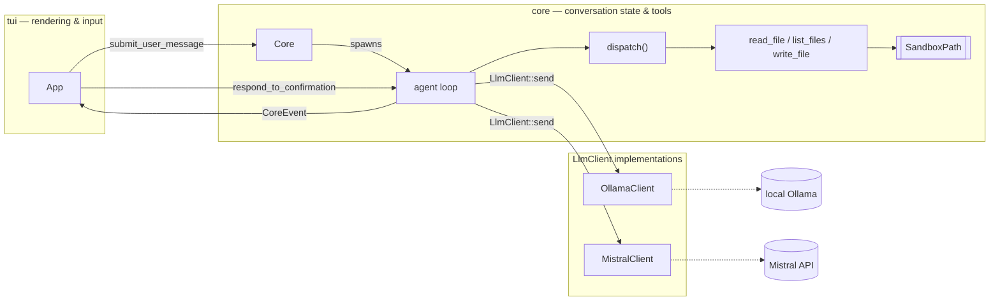

# Architecture

Maintainer-facing design decisions and the reasoning behind them —
the *why* behind each technical choice, not a restatement of what the
code already says. Current security posture lives in `SECURITY.md`.

## Overview



`core` holds conversation state, provider round-trips, and tool
execution; it has zero `ratatui`/`crossterm` imports and exposes
exactly two calls to the rest of the app —
`submit_user_message(text)` and `poll_events()` — plus
`respond_to_confirmation(choice)` for the one case where a tool call
needs to pause for a human decision (see "The confirmation gate"
below). `tui` owns all rendering and input, and never touches
conversation or tool state directly. `cli` is a third, smaller module
for command-line flag parsing, used only by `main.rs`.

Each `submit_user_message` call spawns a plain `std::thread` to do the
provider round-trip and reports back over an `mpsc` channel;
`poll_events` drains it non-blockingly, so the UI loop never stalls on
network I/O. No async runtime — a synchronous main loop plus
thread-per-request is simpler to reason about at this project's scale,
and every provider call is a single blocking HTTP request with no
concurrency of its own to manage.

## Talking to a provider: the `LlmClient` trait

`Core` never touches a provider's HTTP shape directly — it holds an
`Arc<dyn LlmClient + Send + Sync>` and calls one method:

```rust
fn send(&self, messages: &[Message], tools: &[ToolDefinition])
    -> Result<LlmResponse, ChatError>;
```

Adding a provider means writing a new `LlmClient` implementation, not
touching `Core`. `LlmResponse` is `Text(String)` for a final answer or
`ToolCalls(Vec<ToolCall>)` for one or more requested tool invocations;
each provider maps the shared `Message` history into its own private
wire-format type before sending, and never sees `Message` beyond that
mapping step.

`Arc`, not `Box`: the concrete client isn't known until a `--provider`
flag is parsed at startup, so this is dynamic dispatch, not generics.
`Arc` specifically (not `Box`) is required because each
`submit_user_message` call spawns a new thread that needs its own
handle to the client while `Core` keeps using its own — `Arc::clone` is
an O(1) refcount bump giving the spawned thread an independent handle
to the same value, where `Box`'s exclusive ownership could only ever
hand the client to one thread, permanently.

## Conversation history

`Core` holds a `Vec<Message>` that grows for the whole session and is
sent in full with every request — `Message` is an enum (`User`,
`Assistant`, `ToolCalls`, `ToolResult`), not a flat struct with
optional fields, so an invalid combination (e.g. a tool result with no
correlating id) isn't representable at all. History is unbounded and
uncompacted: nothing trims or summarizes it as it grows, so a very long
session sends a correspondingly larger request every time. That's a
deliberate scope boundary, not an oversight — summarization is a real
feature with its own design surface (when to summarize, what to
preserve), not something to bolt on as an afterthought.

`Message::ToolCalls` holds one entry per individual tool call rather
than one entry per LLM turn, even though a provider can request several
calls in a single turn. Verified against the real Mistral API with a
task that requires at least two sequential tool calls to complete:
order and `tool_call_id` correlation are what actually matter for a
correct conversation, not whether the calls are grouped into one
message or several.

History is mutated only on the thread that calls `poll_events()`, never
on the background thread doing the network round-trip. That thread
gets its own cloned snapshot of history to send; `Core`'s persistent
copy is only ever appended to as `CoreEvent`s get drained. This avoids
needing a `Mutex` or any other shared-mutable-state primitive — there's
effectively a single writer.

## Sandboxing: `SandboxPath`

`SandboxPath::new(root, requested)` is the only way to construct a
validated path, and every tool function takes `&SandboxPath`, never a
raw `PathBuf`/`&str` — a call site can't forget to check containment,
because there's no path type it could pass instead that would compile.
This matters more here than in a typical file-access scenario: tool
output feeds back into the LLM conversation, so an escaped read is a
real exfiltration path, not a hypothetical one.

Containment is checked against `std::fs::canonicalize`d paths, not
lexical `.`/`..` normalization — a symlink placed *inside* the sandbox
root pointing *outside* it looks contained as a literal string, and
only resolving it reveals where it really points. `SandboxError`
(`NotFound`, `Escapes`) has fixed, hand-written `Display` text that
never interpolates the actual resolved path, so a rejected symlink's
real target isn't itself disclosed via the error.

`SandboxPath::new_for_write` is a second constructor for a target that
may not exist yet (creating a new file, not just reading one). It
validates the *parent* directory's containment — the parent must
already exist; there's no `mkdir -p` — and, if the target itself
already exists (the overwrite case), still fully canonicalizes and
re-checks it, so a symlink sitting at that name pointing outside the
sandbox is caught the same way a read would catch it.

## Tool execution

`dispatch(root, file_access_security, tool_call) -> Result<String,
ToolError>` is what the agent loop calls for most tool calls —
`read_file` and `list_files` today. It matches on the tool's name
first, then parses that tool's own argument shape, so an unrecognized
name never has to reason about arguments at all, and a new tool means
one match arm plus one function. `tool_definitions()` (the list
actually advertised to a provider) lives right beside `dispatch`'s
match arms specifically so the two can't silently drift apart — a test
asserts the names match.

`write_file` is routed *around* `dispatch`, by name, to
`write_file_with_confirmation` instead. It doesn't fit `dispatch`'s
contract — a pure computation that takes inputs and returns a result —
because it needs to pause mid-call and wait for a human decision (see
"The confirmation gate" below). `dispatch` remains the router for every
tool that doesn't need that; `write_file` is a deliberate exception,
not a sign the abstraction is leaking.

### Content-sensitivity filtering

`SandboxPath` only bounds *where* a path may resolve — it says nothing
about *whether* a file within that boundary is appropriate to touch at
all. `is_content_restricted` checks the canonicalized, root-relative
path (not the raw requested string, so a symlink with an innocuous name
pointing at a blocked file can't bypass it) against a small,
intentionally non-exhaustive list: `.env`/`.env.*`, the `.ssh`
directory (anywhere in the path, not just at the root), `.git/config`
specifically, and `*.pem`/`*.key`. `read_file`, `list_files`, and
`write_file` all check this — only in `strict` mode, `loose` skips it
entirely — before touching the filesystem, refusing with
`ToolError::AccessDenied`. `list_files` still shows a blocked entry's
*name* in its parent listing (existence isn't hidden) but refuses to
enumerate into a blocked directory or read anything inside one.

## Settings

`Settings::load()` reads one setting, `file_access_security`
(`strict`/`loose`, defaulting to `strict`), from
`~/.config/emed-code/settings.toml`, resolved via the `dirs` crate for
correct `XDG_CONFIG_HOME`/`AppData`/`Library` behavior across
platforms. Parsing is split into a pure function (`Settings::parse`,
what the tests exercise) and a thin I/O shell (`Settings::load`) — the
same shape as this project's provider-integration code.

A missing file, an empty file, malformed TOML, or an unrecognized value
all collapse to the same outcome: `Settings::default()`, i.e. `strict`.
There's no partial-recovery logic that tries to salvage a malformed
file's other fields — with fail-safe defaulting already the design,
collapsing every failure mode into the *more* restrictive outcome is
what makes that safe to do; failing open on a typo would turn a config
mistake into a silent security regression.

The settings file lives outside the directory `SandboxPath` bounds,
specifically so a `write_file` tool can never reach or self-modify it —
even via a prompt-injection attempt to "loosen your own access
policy." Same reasoning as resolving the Mistral API key via
`getfrompass` rather than a project-local file: anything that gates
what the model can do must live somewhere the model's own tool access
structurally cannot reach.

## Diffs: generation and rendering

`generate_diff(old: &str, new: &str) -> Vec<DiffLine>` is a thin, pure
wrapper around `similar::TextDiff::from_lines` — the diffing algorithm
itself isn't reimplemented, only mapped into this project's own
`DiffLine` (`Added`/`Removed`/`Unchanged`) shape. Structured per-line
data, not a pre-formatted string, specifically so the TUI can render
`Added`/`Removed` with real color rather than relying on a text
convention like unified diff's `+`/`-` prefixes alone.

`render_diff_lines` turns that data into styled ratatui `Line`s —
a colored *background* band (red for removed, green for added), not
colored text, so a future per-line syntax-highlighting pass has the
text-color channel free rather than competing with diff coloring for
it. Each line also keeps a `+`/`-`/` ` text prefix alongside the color,
so a terminal without color support, or a color-blind user, still gets
a real signal. The background currently covers only the line's own
text width, not a full edge-to-edge band — that needs the real render
width, which isn't available at this stage; a future pass can pad to
width once there's a concrete reason to.

## The confirmation gate

Every other `Core`↔`App` interaction is one-directional — the
background thread only ever *sends* `CoreEvent`s. `write_file` needs
the opposite: the loop must pause mid-call, let the user see a diff,
and only then know whether to write and what tool result to hand back
to the model.

A fresh `mpsc` channel is created on every `submit_user_message` call,
mirroring the fresh thread spawned each time (a single long-lived
channel wouldn't work here — `mpsc::Receiver` isn't `Clone`, so it
could only ever move into the first spawned thread). `Core` keeps the
`Sender` half; `respond_to_confirmation` sends through whichever one is
currently stored, a no-op if nothing is actually waiting.

`write_file_with_confirmation` validates the path — sandbox containment
and the content-sensitivity blocklist, identical to `write_file` itself
— *before* ever proposing anything, so a forbidden path is rejected
immediately with no confirmation dialog shown at all; there's nothing
to confirm about a request that was never going to be allowed. Only a
validated write generates a diff, sends `CoreEvent::WriteProposed`, and
blocks on the answer. A dropped or errored receive (e.g. the app
exiting mid-confirmation) resolves to declining the write, never to a
silent apply. On approval, it delegates the actual write back to
`write_file` — a deliberate, cheap re-validation in exchange for
keeping sandboxing/blocklist logic in exactly one place rather than
duplicating it. A decline flows through the same `Result<String,
ToolError>` shape every other tool result already uses (a
`ToolError::WriteDeclined` variant), so nothing downstream needs a
separate code path for it.

No per-write correlation id is needed on `WriteProposed`: the agent
loop already processes tool calls one at a time, so a model batching
several `write_file` calls in one turn just becomes several sequential
prompts — only one confirmation is ever outstanding at once.

On the `App` side, the chat log's element type (`LogEntry`) is an enum
— `Text(String)` or `Diff { path, diff }` — rather than a plain string,
the only way a proposed write's diff can carry real per-line color
through to rendering. `App` tracks `pending_confirmation:
Option<String>` (the path, if any write is awaiting a decision); while
it's `Some`, scrolling still works (so a long diff can be reviewed
before deciding), but every other key is routed to confirm/decline
instead of normal typing — `1`/`Enter` apply, `2` declines, both act
immediately, no `Enter` needed for the numbers. The input box itself is
replaced by a compact numbered menu for the duration. Quit is
unaffected either way — it's checked before any key ever reaches `App`.

## Error handling

Provider errors are `ChatError` (`Connection`, `MalformedResponse`,
`Auth`), with hand-written `Display`/`std::error::Error` impls rather
than a derive-macro crate — a handful of variants is a small enough
amount of code that writing it directly is more instructive than
depending on something to generate it. `ChatError::Auth` exists for
Mistral's API-key rejection case; `OllamaClient` has no way to trigger
it (no credentials involved), but the enum is shared across every
`LlmClient` implementation.

`extract_mistral_reply` handles the fact that a Mistral response can be
one of two shapes — a success envelope or an error envelope — with no
HTTP status code available at that parsing layer to tell them apart up
front: it tries the success shape first, then the error shape, and
surfaces the *original* parse error as `ChatError::MalformedResponse`
if both fail (a generic "wasn't valid JSON" is more useful than "also
didn't look like an error envelope").

`ChatError::Connection` currently flattens every `ureq` failure
(timeout, connection refused, DNS, TLS) into one `String`. That's fine
today — nothing needs to distinguish them yet. It would need to become
its own small enum the day retry-vs-fail-fast logic needs to tell those
cases apart; not worth building ahead of that actual need.

## Credentials

`MistralClient::new` takes an already-resolved API key rather than
performing its own `getfrompass`/env-var lookup — resolving *which*
source supplies the key, and what happens if neither has one, are
startup-wiring concerns that belong to `main.rs`, not the client. This
keeps `MistralClient` scoped to one responsibility: given a key and a
model, do the HTTP round-trip and map errors correctly.
`lookup_mistral_api_key` tries `getfrompass` first, falling back to the
`MISTRAL_API_KEY` env var only when `getfrompass` has no value — see
`SECURITY.md` for the credential-handling specifics.

## Startup wiring

`main.rs` parses CLI flags, resolves the model and provider, and
constructs the matching `LlmClient` before entering the render loop.
For Mistral, this is also where the API key lookup happens and its
result acted on: on success, a startup line reports which source
supplied it (never the value); on failure, `main` returns an error
before any terminal setup happens, rather than opening with no working
provider. The active provider is shown as a static label in the chat
title for the whole session — parsed once at startup, with no
live-switching mechanism, matching how the underlying CLI selection
itself is a one-time choice.

## Testing strategy

Provider integration code is split so the actual network call is as
small as possible, with everything else a plain, pure function over
data: request-building and response-parsing are unit-tested with
fixture data; the network call itself has no unit test, only a
`local`-feature-gated smoke test against the real service. The agent
loop's orchestration is tested with a scripted fake `LlmClient` rather
than a mock HTTP server — enough to prove the loop's control flow
(tool dispatch, the confirmation pause, the tool-call cap) without any
network involved. `App`-level tests assert only on `App`'s own
observable state (log content, input cleared) rather than mocking
`Core` — `Core`'s own correctness is already covered by its own tests,
and the full path still gets exercised by actually running the app.

Some behavior can only be verified against a real external service —
Ollama locally, or the real Mistral API. Those tests live in their own
files under `tests/`, gated with `#![cfg(feature = "local")]`, and only
run via `cargo test --features local` (`just test`); a plain `cargo
test`/CI run never compiles them.

## Terminal/TUI mechanics

`main.rs` wraps its event loop in `ratatui::run(...)`, which installs a
panic hook that restores the terminal even if the closure panics —
panic-safe terminal restoration without any code of our own. The loop
polls for input with a short timeout rather than blocking on it, so a
reply arriving from `Core` while the user isn't typing still gets
redrawn promptly, without adding a second channel to select across.

Chat lines are word-wrapped by hand (`wrap_line`/`wrap_text`, using
real Unicode width measurement) rather than relying on `Paragraph`'s
own wrapping, so the exact same line count drives both what's rendered
and the scroll math — letting rendering and scrolling disagree about
how many lines exist is what causes a stuck or unresponsive scrollbar.
`scroll_offset` is a distance-from-the-bottom, clamped every frame
against the true ceiling (total lines minus visible height); staying at
`0` doubles as "the user is following along," so new content arriving
doesn't yank a manually-scrolled-up user back to the bottom.
